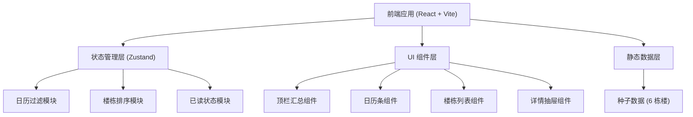
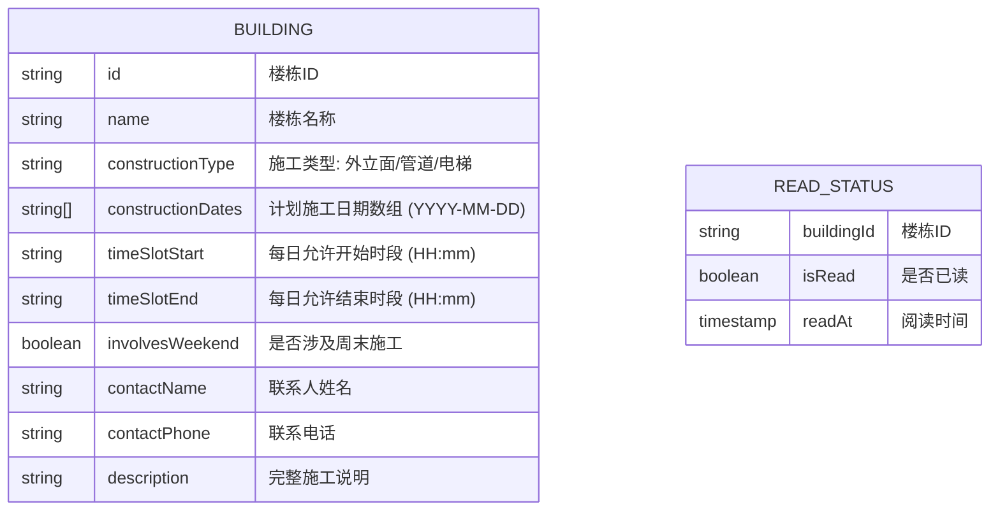

## 1. 架构设计

## 2. 技术描述
- **前端框架**：React 18 + TypeScript
- **构建工具**：Vite 5
- **样式方案**：Tailwind CSS 3
- **状态管理**：Zustand（日历过滤、楼栋排序、已读状态分模块管理）
- **图标库**：lucide-react
- **后端**：无（纯前端静态应用）
- **数据**：内置种子数据（Mock）

## 3. 路由定义
| 路由 | 用途 |
|------|------|
| / | 主页（单页应用，无其他路由） |

## 4. 数据模型

### 4.1 数据模型定义

### 4.2 种子数据概览
共 6 栋楼，覆盖三种施工类型（外立面、管道、电梯），包含工作日施工和周末施工场景，每栋楼配置独立的施工日期范围、时段和联系人。

## 5. 模块拆分

| 模块 | 文件路径 | 职责 |
|------|----------|------|
| 种子数据 | `src/data/buildings.ts` | 6 栋楼的模拟数据 |
| 类型定义 | `src/types/index.ts` | Building、ReadStatus 等 TypeScript 类型 |
| 日历过滤 | `src/utils/calendarFilter.ts` | 根据选中日期过滤施工楼栋 |
| 楼栋排序 | `src/utils/buildingSorter.ts` | 今日置顶、排序逻辑 |
| 已读状态 | `src/store/useReadStore.ts` | Zustand store，管理已读/未读状态 |
| 日历状态 | `src/store/useCalendarStore.ts` | Zustand store，管理选中日期 |
| 顶栏组件 | `src/components/SummaryHeader.tsx` | 统计汇总展示 |
| 日历条组件 | `src/components/CalendarStrip.tsx` | 本周日期横向展示与筛选 |
| 楼栋卡片 | `src/components/BuildingCard.tsx` | 单栋楼信息卡片 |
| 楼栋列表 | `src/components/BuildingList.tsx` | 楼栋列表容器 |
| 详情抽屉 | `src/components/DetailDrawer.tsx` | 右侧抽屉展示完整信息 |
